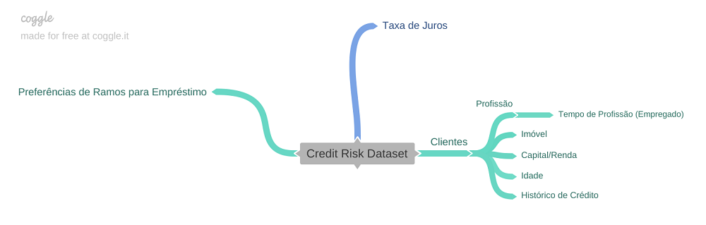
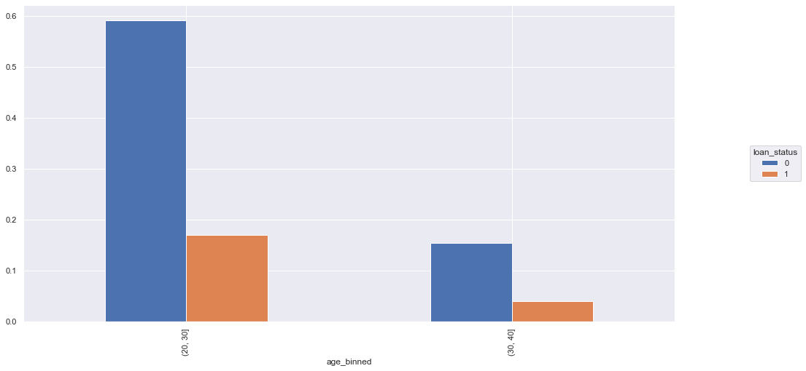
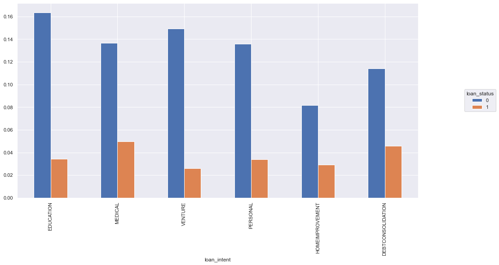
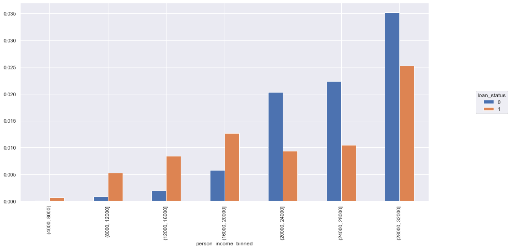
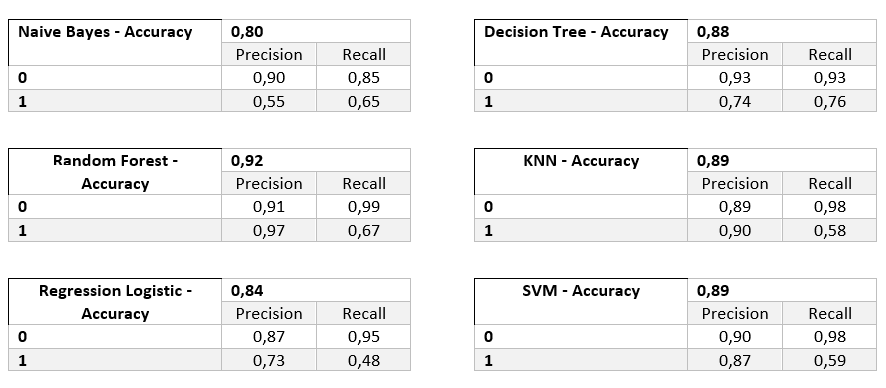
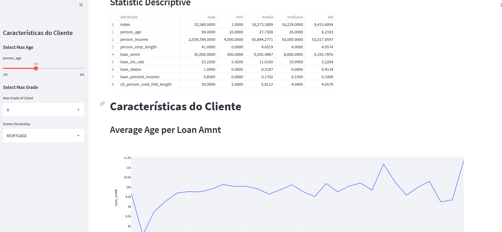

<h1 align="center">Credit Card Risk</h1>

<h1 align="center">
  
</h1>

<h1 align="center">Questão e Entendimento de Negócio</h1>

1.	Contexto da Problemática Hipótetica

Um banco fictício realizou uma reunião com o grupo de Gestão de Risco de Crédito para discutir a importância de se desenvolver ferramentas que pudessem auxiliar na predição de clientes que poderiam ou não cumprir os contratos de empréstimos realizados. Explanou-se sobre a importância desse resultado para que durante uma crise econômica, a empresa obtivesse uma alta precisão de análise para minimizar possíveis problemas causados pela inadimplência dos clientes.

2.	Questionamento

<ul>
<li>Como realizar uma predição de quais clientes cumprirão ou não o pagamnto dos empréstimos?</li>
	
<li>Como disponibilizar os dados de vendas de forma que o Grupo de Gestão de Risco de Crédito possa acessar de forma reforma?</li>
</ul>

3.	Soluções

<ul>
<li>Previsão dos clientes pagantes utilizando algoritmos de Machine Learning;</li>
	
<li>Visualização dos Resutaldos das Vendas feita de forma remota por meio de Streamlit/Heroku</li>
</ul>

<h1 align="center">Desenvolvimento do Projeto</h1>

É apresentada uma tabela no DataSet: a Tabela "credit_risk_dataset", que contém dados sobre as características dos clientes: idade, anos inseridos no mercado de trabalho, tipo de moradia, finalidade do empréstimo, montante de renda e dívida dos clientes, etc.

1.	Descrição dos Dados

Uma das primeiras partes do projeto é realizada no estudo do tipo de dados que temos disponíveis para o desenvolvimento do projeto. Nessa etapa são obtidos conhecimentos sobre os dados tabelados: qual a quantidade de observações e atributos apresentados, quais os tipos de atributos, etc.

2.	Feature Engineering

Na etapa de Feature Engineering são selecionadas as melhores features para o modelo de predição, criação de novas features derivadas das originárias e transformação matemática de features para que seja utilizada ao máximo a maior quantidade de dados possíveis do dataset.

- Missing Values:

No caso de dados ausentes podem ser aplicados alguns métodos: excluir ou preencher os dados faltantes. Neste projeto existem duas colunas da tabela original com dados faltantes. A primeira tratava de pessoas sem informação sobre "anos inseridos no mercado de trabalho", logo, foram inseridos '0', pois foi usada a hipótese de que as pessoas não estão empregadas. A segunda coluna apresentava locunas sobre a taxa de juros dos empréstimos, como não havia informação suficiente para cálculo da taxa, foi realizada a média de taxa de juros de cada "grade" (representados de A à G), e assim, preenchidos os valores faltantes de acordo com o grau de empréstimo do cliente. 

	
<h1 align="center">Mapa Mental de Hipóteses</h1>

O Mapa Mental pode ser utilizado como um “guia” para observar quais são as variáveis mais importantes para a Análise Exploratória dos Dados e quais serão mais relevantes para a criação das hipóteses sobre o desenvolvimento e insights que serão apresentados. Dado que o projeto tem a finalidade de predição de clientes pagantes ou devedores, devemos selecionar as variáveis que serão agentes para tal objetivo e quais atributos destes são mais importantes para a validação das hipóteses.

<h1 align="center">
  
</h1>
<h1 align="center">Análise Exploratória de Dados</h1>

Após a filtragem de hipóteses serão realizadas as análises sobre as features e como estas agem sozinhas ou em combinação com outras features. O projeto teve oito hipóteses finais que foram validadas ou refutadas pelo estudo gráfico de cada uma delas (informações apresentadas no notebook Jupyter). 

<h1 align="center">Melhores Insights - Hipóteses</h1>

**H1.** Clientes com idades menores tendem a fazer mais empréstimos

Verdadeiro.

  

**H4.** Clientes que tem como finalidade para o empréstimo reformas residenciais são maioria

Falso: Empréstimos para a Educação são maioria

  

**H7.** Clientes com renda superior a 20000 tendem a pagar mais os empréstimos

Verdadeiro.

  

<h1 align="center">Machine Learning Modelling</h1>

Para a escolha da técnica de Machine Learning que seria utilizada para o desenvolvimento dos modelos foram testados e coletados resultados de acurácia das seguintes técnicas:

o	Naive Bayes;

o	Decision Tree;

o	Random Forest;

o	KNN;

o	Regression Logistic;

o	SVM.

Os resultados das acurácias de cada técnica foram concentrados de forma tabulada e comparados.

<h1 align="center">
  
</h1>

<h1 align="center">Obtenção dos resultados de forma remota</h1>

A última parte do projeto foi o desenvolvimento de API e utilização de Heroku para disponibilizar dados em Cloud. 
É possível visualizar o dashboard disponível remoto por meio do link:

<h1 align="center">
  
</h1>

<h1 align="center">Referências</h1>
https://www.kaggle.com/laotse/credit-risk-dataset    - Acesso em: 02/11/2021

https://www.bcgbrasil.com.br/Divulgacao-informacoes/Gestao-Risco/Paginas/Risco-de-Credito.aspx - Acesso em: 29/11/2021
